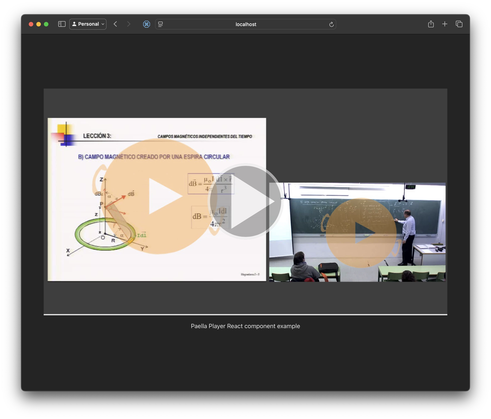

In this document, we will explore how to implement a video player using the paella-core library within a React application created with Vite. Vite is a modern web application build tool that focuses on providing a 
fast and efficient development experience. On the other hand, React is a popular JavaScript library for building user interfaces, known for its flexibility and ease of use.

## Creating a Vite Project with React and TypeScript SWC

To get started, it is essential to have Node.js 20, or a newer LTS version, installed on your system. Once you have Node.js 20 installed, you can proceed to create a new Vite project.

1. Open your terminal and run the following command to create a new Vite project:

```bash
npm create vite@latest
```

2. Follow the setup assistant's instructions. When prompted to select a template, choose `React` as the framework and `TypeScript SWC` as the variant. This will allow you to create a Vite project with React and TypeScript.

3. Once you have selected the template, Vite will prompt you to enter a name for your project. Enter the desired name and press Enter.

4. Now, navigate to the directory of your newly created project:

```bash
cd your-project-name
```

5. Finally, install the required dependencies by running:
   
```bash
npm install
```

With these steps, you will have successfully set up a Vite project using the React template with TypeScript SWC. You are now ready to start developing your application and adding features like implementing a video player using paella-core, which will be covered in 
subsequent chapters.

## Installing paella-core

To use the paella-core library in your React application, you need to install it as a dependency. You can do this by running the following command in your project directory. In this example, we will use two libraies: the main Paella Player core library and a complementary liblrary with a set of useful paella plugins.


```bash
npm install @asicupv/paella-core @asicupv/paella-basic-plugins
```

Now, you can execute the following command to start the development server:

```bash
npm run dev
```

This will start the Vite development server, and you can view your application in the browser at `http://localhost:5173` (or the port specified in the terminal).


## Adding the player configuration and video manifest files

In this tutorial we dont going to explain how to create a player. To do it, you can check the following tutorials:

- [quick start tutorial](/tutorial/quick_start): create a basic player and play a video file.
- [Two streams](/tutorial/two_streams): use a video manifest file to play a video with two streams.
- [Plugins](/tutorial/plugins): add plugins to the player.

So in this step we are simply going to add the files we need for the player to work. These files should be placed in the public folder of the application, as they are not compiled (they are loaded directly from the server at runtime).

Create the following folders and files in the public folder:

**public/config/config.json**

```json
{
    "repositoryUrl": "repository",
    "manifestFileName": "data.json",
    "defaultLayout": "presenter-presentation",
    "defaultLanguage": "en",
    "defaultAudioStream": "presenter",
    
    "logLevel": "INFO",

    "plugins": {
        "es.upv.paella.singleVideo": {
            "enabled": false,
            "dualVideoContentIds": [
                "presenter-presentation-dynamic",
                "presenter-2-presentation-dynamic",
                "presenter-presenter-2-dynamic",
                "presenter-presentation",
                "presenter-2-presentation",
                "presenter-presenter-2"
            ],
            "validContent": [
                {
                    "id": "presenter",
                    "content": [
                        "presenter"
                    ],
                    "icon": "present-mode-2.svg",
                    "title": "Presenter"
                },
                {
                    "id": "presentation",
                    "content": [
                        "presentation"
                    ],
                    "icon": "present-mode-1.svg",
                    "title": "Presentation"
                },
                {
                    "id": "presenter-2",
                    "content": [
                        "presenter-2"
                    ],
                    "icon": "present-mode-1.svg",
                    "title": "Presentation"
                }
            ]
        },
        "es.upv.paella.singleVideoDynamic": {
            "enabled": true,
            "dualVideoContentIds": [
                "presenter-presentation-dynamic",
                "presenter-2-presentation-dynamic",
                "presenter-presenter-2-dynamic",
                "presenter-presentation",
                "presenter-2-presentation",
                "presenter-presenter-2"
            ],
            "validContent": [
                {
                    "id": "presenter",
                    "content": [
                        "presenter"
                    ],
                    "icon": "present-mode-2.svg",
                    "title": "Presenter"
                },
                {
                    "id": "presentation",
                    "content": [
                        "presentation"
                    ],
                    "icon": "present-mode-1.svg",
                    "title": "Presentation"
                },
                {
                    "id": "presenter-2",
                    "content": [
                        "presenter-2"
                    ],
                    "icon": "present-mode-1.svg",
                    "title": "Presentation"
                }
            ]
        },
        "es.upv.paella.dualVideo": {
            "enabled": false,
            "validContent": [
                {
                    "id": "presenter-presentation",
                    "content": [
                        "presenter",
                        "presentation"
                    ],
                    "icon": "present-mode-3.svg",
                    "title": "Presenter and presentation"
                },
                {
                    "id": "presenter-2-presentation",
                    "content": [
                        "presenter-2",
                        "presentation"
                    ],
                    "icon": "present-mode-3.svg",
                    "title": "Presenter and presentation"
                },
                {
                    "id": "presenter-presenter-2",
                    "content": [
                        "presenter",
                        "presenter-2"
                    ],
                    "icon": "present-mode-3.svg",
                    "title": "Presenter and presentation"
                }
            ],
            "tabIndexStart": 20
        },
        "es.upv.paella.dualVideoPiP": {
            "enabled": true,
            "validContent": [
                {
                    "id": "presenter-presentation-pip",
                    "content": [
                        "presenter",
                        "presentation"
                    ],
                    "icon": "present-mode-pip.svg",
                    "title": "Picture in Picture"
                },
                {
                    "id": "presenter-2-presentation-pip",
                    "content": [
                        "presenter-2",
                        "presentation"
                    ],
                    "icon": "present-mode-pip.svg",
                    "title": "Picture in Picture"
                },
                {
                    "id": "presenter-presenter-2-pip",
                    "content": [
                        "presenter",
                        "presenter-2"
                    ],
                    "icon": "present-mode-pip.svg",
                    "title": "Picture in Picture"
                }
            ],
            "dualVideoContentIds": [
                "presenter-presentation-dynamic",
                "presenter-2-presentation-dynamic",
                "presenter-presenter-2-dynamic",
                "presenter-presentation",
                "presenter-2-presentation",
                "presenter-presenter-2"
            ],
            "tabIndexStart": 20
        },
        "es.upv.paella.dualVideoDynamic": {
            "enabled": true,
            "validContent": [
                {
                    "id": "presenter-presentation-dynamic",
                    "content": [
                        "presentation",
                        "presenter"
                    ],
                    "icon": "present-mode-3.svg",
                    "title": "Presenter and presentation"
                },
                {
                    "id": "presenter-2-presentation-dynamic",
                    "content": [
                        "presenter-2",
                        "presentation"
                    ],
                    "icon": "present-mode-3.svg",
                    "title": "Presenter and presentation"
                },
                {
                    "id": "presenter-presenter-2-dynamic",
                    "content": [
                        "presenter",
                        "presenter-2"
                    ],
                    "icon": "present-mode-3.svg",
                    "title": "Presenter and presentation"
                }
            ],
            "pipContentIds": [
                "presenter-presentation-pip",
                "presenter-2-presentation-pip",
                "presenter-presentation-2-pip"
            ],
            "allowSwitchSide": false
        },
        "es.upv.paella.tripleVideo": {
            "enabled": true,
            "validContent": [
                {
                    "id": "presenter-presenter-2-presentation",
                    "content": [
                        "presenter",
                        "presenter-2",
                        "presentation"
                    ],
                    "icon": "present-mode-4.svg",
                    "title": "Presenter and presentation"
                },
                {
                    "id": "presenter-2-presenter-3-presentation",
                    "content": [
                        "presenter-2",
                        "presenter-3",
                        "presentation"
                    ],
                    "icon": "present-mode-4.svg",
                    "title": "Presenter and presentation"
                }
            ]
        },
        "es.upv.paella.imageVideoFormat": {
            "enabled": true,
            "order": 3
        },
        "es.upv.paella.htmlVideoFormat": {
            "enabled": true,
            "order": 1
        },
        "es.upv.paella.mp4VideoFormat": {
            "enabled": true,
            "order": 2
        },
        "es.upv.paella.audioVideoFormat": {
            "enabled": true
        },
        "es.upv.paella.playPauseButton": {
            "enabled": true,
            "order": 1,
            "container": "playbackBar",
            "side": "left"
        },
        "es.upv.paella.videoCanvas": {
            "enabled": true,
            "order": 1
        },
        "es.upv.paella.audioCanvas": {
            "enabled": true,
            "order": 1
        },
        "es.upv.paella.localStorageDataPlugin": {
            "enabled": true,
            "order": 0,
            "context": [
                "default",
                "trimming",
                "preferences"
            ]
        },
        "es.upv.paella.currentTimeLabel": {
            "enabled": true,
            "side": "left",
            "order": 5,
            "showTotalTime": true
        },
        "es.upv.paella.backwardButtonPlugin": {
            "enabled": true,
            "side": "left",
            "order": 1
        },
        "es.upv.paella.forwardButtonPlugin": {
            "enabled": true,
            "side": "left",
            "order": 2
        },
        "es.upv.paella.volumeButtonPlugin": {
            "enabled": true,
            "side": "left",
            "order": 4
        },
        "es.upv.paella.layoutSelector": {
            "enabled": true,
            "side": "right",
            "order": 101,
            "parentContainer": "playbackBar",
            "menuTitle": "Layout"
        },
        "es.upv.paella.fullscreenButton": {
            "enabled": true,
            "side": "right",
            "order": 103
        }
    }
}
```

**public/config/pip.svg**


**public/config/presentation.svg**


**public/config/presenter-presentation.svg**


**public/config/presenter.svg**


**public/repo/dual-stream/data.json**

```json
{
    "metadata": {
        "preview": "https://repository.paellaplayer.upv.es/belmar-multiresolution/preview/belmar-preview.jpg"
    },
    "streams": [
        {
            "sources": {
                "mp4": [
                    {
                        "src": "https://repository.paellaplayer.upv.es/belmar-multiresolution/media/720-presenter.mp4",
                        "mimetype": "video/mp4"
                    }
                ]
            },
            "content": "presenter",
            "role": "mainAudio"
        },
        {
            "sources": {
                "mp4": [
                    {
                        "src": "https://repository.paellaplayer.upv.es/belmar-multiresolution/media/720-presentation.mp4",
                        "mimetype": "video/mp4"
                    }
                ]
            },
            "content": "presentation"
        }
    ]
}
```

## Source code files

To begin with, we are going to modify the source code files of the Vite template. First, we are going to leave only the files we are interested in so that we start with a clean project. Make sure you leave only the following files:

```
paella-react-project
├── public
│   ├── config
│   │   ├── config.json
│   │   ├── pip.svg
│   │   ├── presentation.svg
│   │   ├── presenter-presentation.svg
│   │   ├── presenter.svg
|   └── repo
│       └── dual-stream
│           └── data.json
├── src
│   ├── App.tsx
│   ├── index.css
│   ├── main.tsx
│   └── vite-env.d.ts
|-- eslint.config.js
├── index.html
|-- package-lock.json
├── package.json
├── tsconfig.json  // Maybe you have other tsconfig files, you can keep them
└── vite.config.ts
```

Modify the following files:

**src/App.tsx**

```tsx
export default function App() {
  return (
    <>
      <p>
        Paella Player React component example
      </p>
    </>
  )
}
```

**src/index.css**

```css
:root {
  font-family: system-ui, Avenir, Helvetica, Arial, sans-serif;
  line-height: 1.5;
  font-weight: 400;

  color-scheme: light dark;
  color: rgba(255, 255, 255, 0.87);
  background-color: #242424;

  font-synthesis: none;
  text-rendering: optimizeLegibility;
  -webkit-font-smoothing: antialiased;
  -moz-osx-font-smoothing: grayscale;
}

#root {
  max-width: 1280px;
  width: 90%;
  margin: 0 auto;
  padding: 2rem;
  text-align: center;
}

a {
  font-weight: 500;
  color: #646cff;
  text-decoration: inherit;
}
a:hover {
  color: #535bf2;
}

body {
  margin: 0;
  display: flex;
  place-items: center;
  min-width: 320px;
  min-height: 100vh;
}

h1 {
  font-size: 3.2em;
  line-height: 1.1;
}

@media (prefers-color-scheme: light) {
  :root {
    color: #213547;
    background-color: #ffffff;
  }
  a:hover {
    color: #747bff;
  }
  button {
    background-color: #f9f9f9;
  }
}
```

**src/main.tsx**

```tsx
import { StrictMode } from 'react'
import { createRoot } from 'react-dom/client'
import './index.css'
import App from './App.tsx'

createRoot(document.getElementById('root')!).render(
  <StrictMode>
    <App />
  </StrictMode>,
)
```

## Player component

### Create the player instance using a reference to the container

Now we are going to create a new component that will be responsible for creating the player. This component will be called `Player.tsx` and will be placed in the `src` folder.
Create the file `src/Player.tsx` and add the following code:

```tsx
import { useEffect, useRef } from "react"
import { Paella } from "@asicupv/paella-core"
import { basicPlugins } from "@asicupv/paella-basic-plugins";

import "@asicupv/paella-core/paella-core.css";
import "@asicupv/paella-basic-plugins/paella-basic-plugins.css";

import "./Player.css"

export default function Player() {
    const playerContainerRef = useRef(null);
    const playerInstance = useRef<Paella | null>(null);

    useEffect(() => {
        if (!playerContainerRef.current) {
            return;
        }
        
        if (!playerInstance.current) {
            playerInstance.current = new Paella(playerContainerRef.current, {
                plugins: [
                    ...basicPlugins
                ]
            });

            playerInstance.current.loadManifest()
                .then(() => {
                    console.log("Loaded manifest");
                });
        }
    }, [playerContainerRef]);

    return <div className="player-container" ref={playerContainerRef}></div>
}
```

In the code above we have created a simple player with the basic plugins. The import of the `Paella` class, plugins and CSS files is done in the same way as in the Paella Player vanilla tutorials. In the header of the file we also import the CSS file for the player and the `useEffect` and `useRef` hooks from React.

The component returns a `div` element that will be the container of the player. We use the `useRef` hook to create a reference to the container that later will be used to create the player instance. To store the player instance we create another reference to keep the instance of the player alive during the lifecycle of the component.

To load the player we use the `useEffect` hook, that will be executed when the player container reference is changed. Inside the effect, we first check that the reference is valid. Then we check if the player instance is already created. If not, we create the player instance using the `div` reference. The code inside the `if` statement is the same as in the vanilla tutorials. We create a new instance of the `Paella` class, passing the reference to the `div` element and the configuration object with the plugins, and then we call the `loadManifest` method to load the video manifest file.

### Create the player instance using a unique id

Using a reference is not the only way to create the player. You can also use the `useId` hook to create a unique id for the player container. The code will look like this:

```tsx
import { useEffect, useId, useRef } from "react"
import { Paella } from "@asicupv/paella-core"
import { basicPlugins } from "@asicupv/paella-basic-plugins";

import "@asicupv/paella-core/paella-core.css";
import "@asicupv/paella-basic-plugins/paella-basic-plugins.css";

import "./Player.css"


export default function Player() {
    const playerId = useId();
    const playerInstance = useRef<Paella | null>(null);

    useEffect(() => {
        if (!playerInstance.current) {
            playerInstance.current = new Paella(playerId, {
                plugins: [
                    ...basicPlugins
                ]
            });

            playerInstance.current.loadManifest()
                .then(() => {
                    console.log("Loaded manifest");
                });
        }

    }, [playerId]);

    return <div className="player-container" id={playerId}></div>
}
```

These are only two examples of how to create the player using React, but you can use any other method you want. The important thing is to create the player instance, linking it with the container element, and then call the `loadManifest` method to load the video manifest file.

## Styling the player

Lastly, we need to add the CSS file for the player. In this simple CSS code we are going to set the width of the player, and specify its aspect ratio. Create the file `src/Player.css` and add the following code:

```css
.player-container {
    width: 100%;
    aspect-ratio: 16/9;
}
```

To test the player, you'll need to specify the identifier of the video manifest file in the `id` parameter of the URL. The manifest file is under the `dual-stream` folder in the `public/repo` folder. The URL should look like this:

```
http://localhost:5173/?id=dual-stream
```

