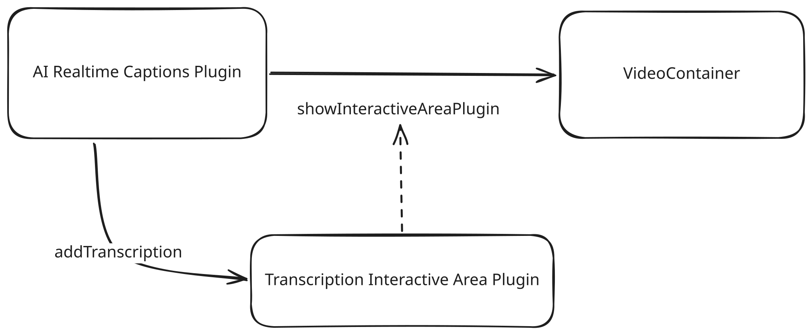

The Interactive Area is a dynamic panel that shares display space with the video. It can display interactive content closely related to the current playback time, such as transcriptions, live translations, or time-linked quizzes.

---

## Table of Contents

- [Overview](#overview)
- [InteractiveAreaPlugin Base Class](#interactiveareaplugin-base-class)
- [VideoCanvasArea Panel API](#videocanvasarea-panel-api)
- [CSS Custom Properties](#css-custom-properties)
- [Plugin Registration](#plugin-registration)

---

## Overview

The Interactive Area appears to the right of the video on wide viewports and below the video on narrow viewports. Content is displayed via `InteractiveAreaPlugin` instances that return an `HTMLElement` from their `getContent()` method.

Key symbols:

| Symbol | Description |
|--------|-------------|
| `InteractiveAreaPlugin` | Base class to extend for interactive area plugins |
| `VideoCanvasArea` | Panel API for showing, hiding, and resizing the interactive area |

---

## InteractiveAreaPlugin Base Class

Extends `Plugin<PluginC>` and registers itself with `type = "interactiveArea"`.

### Methods

### `get type()` → `string`

Returns the fixed string `"interactiveArea"`.

```typescript
get type() { return "interactiveArea"; }
```

### `async getContent(): Promise<HTMLElement>`

**Mandatory to override.** Returns the DOM element that will be displayed in the interactive area panel. This is called each time `showInteractiveAreaPlugin(pluginName)` is invoked, so you can generate content dynamically based on the current playback time.

```typescript
async getContent(): Promise<HTMLElement> {
    const div = document.createElement("div");
    div.innerHTML = "Hello, Interactive Area!";
    return div;
}
```

### `async isEnabled(): Promise<boolean>`

Inherited from `Plugin`. Returns the value of `this._config.enabled`, or `false` by default. Override to implement dynamic enable/disable logic.

### `async load(): Promise<void>`

Inherited from `Plugin`. Called once when the plugin is initialized. Override to set up DOM elements, bind events, etc.

### `async unload(): Promise<void>`

Inherited from `Plugin`. Called when the plugin is torn down. Override to clean up resources.

### Properties

| Property | Type | Default | Description |
|----------|------|---------|-------------|
| `player` | `Paella` | — | The player instance |
| `config` | `ConfigT` | `{}` (cast) | Read-only access to config |
| `order` | `number \| null` | `0` | Loading order |
| `description` | `string \| null` | `""` | Human-readable description |
| `name` | `string \| null` | set at registration | Unique plugin identifier |

---

## VideoCanvasArea Panel API

Access the panel via `player.videoCanvasArea`.

### `showInteractiveAreaPlugin(pluginName: string): Promise<void>`

Shows the interactive area panel and loads the named plugin's content. Calls `getContent()` on the plugin and inserts the returned element into the panel.

### `hidePanel(): void`

Hides the panel. Content is retained in memory.

### `setPanelSize(size: PanelSize): void`

Sets the panel size explicitly.

| Size | Video Width | Panel Width |
|------|-------------|-------------|
| `"small"` | 67% | 33% |
| `"medium"` | 50% | 50% |
| `"large"` | 33% | 67% |

### `get currentPanelSize(): "small" \| "medium" \| "large"`

Returns the current panel size.

### `increasePanelSize(): void`

Cycles to the next larger size (`small → medium → large`).

### `decreasePanelSize(): void`

Cycles to the next smaller size (`large → medium → small`).

### `refreshPanelContent(): Promise<void>`

Refreshes the currently visible panel by calling `getContent()` on the current plugin and replacing the DOM content.

### `get currentPluginName(): string \| null`

Returns the name of the currently visible interactive area plugin, or `null` if the panel is hidden.

---

## CSS Custom Properties

Override these in your application's CSS to customize the interactive area layout.

### Panel Size Variables

| Variable | Default | Description |
|----------|---------|-------------|
| `--interactive-area-small-size` | `33%` | Panel width at `small` size |
| `--interactive-area-medium-size` | `50%` | Panel width at `medium` size |
| `--interactive-area-large-size` | `66%` | Panel width at `large` size |

### Button Variables

| Variable | Default | Description |
|----------|---------|-------------|
| `--interactive-area-buttons-width` | `70px` | Width of resize button strip (horizontal layout) |
| `--interactive-area-buttons-height` | `70px` | Height of resize button strip (vertical layout) |
| `--interactive-area-buttons-padding` | — | Padding inside the button area |
| `--interactive-area-buttons-gap` | — | Gap between resize buttons |

### Button Styling Variables

| Variable | Default | Description |
|----------|---------|-------------|
| `--interactive-area-button-icon-color` | `var(--icon-color)` | Icon SVG color |
| `--interactive-area-button-background-color` | `var(--main-bg-color)` | Button background |
| `--interactive-area-button-border-radius` | `var(--button-border-radius)` | Button border radius |
| `--interactive-area-button-border` | `none` | Button border |

---

## Plugin Registration

Register interactive area plugins by passing them to the player at initialization:

```typescript
import { Paella } from "@asicupv/paella-core";
import MyInteractiveAreaPlugin from "your-plugin-package";

const player = new Paella('playerContainer', {
    plugins: [
        {
            plugin: MyInteractiveAreaPlugin,
            config: { enabled: true }
        }
    ]
});
await player.loadManifest();
```

The `interactiveArea` type is automatically recognized when the plugin class extends `InteractiveAreaPlugin`.


## Example: AI Transcriptions

The [/plugins/transcription_interactive_area_plugin](Interactive Area Plugin) is included in `paella-core` because it is an infrastructure plugin used to display audio transcriptions and similar content. This plugin does not manage the transcriptions themselves; it merely provides an API for adding them: the plugin uses the Interactive Area to display content via its API.

As a source of transcripts, the [/plugins/ai_realtime_captions_plugin](RealtimeCaptionsPlugin) plugin uses the transcription plugin to display subtitles generated automatically using artificial intelligence.

This combination of plugins is a clear example of how to use the interactive area: one plugin manages the display of the interactive area, whilst another plugin acts as the data source.



1. The user enables transcription via the user interface in the realtime captions plugin
2. The plugin loads the infrastructure required to generate the transcripts
3. Once the transcription system has loaded, the TranscriptionInteractiveArea plugin is loaded into the interactive area container using the API `player.videoCanvasArea.showInteractiveAreaPlugin()` to start the display.
4. The transcription system sends the transcription chunks via the plugin’s API. To do this, it first retrieves the plugin instance using the API `player.getPlugin("es.upv.paella.transcriptInteractiveAreaPlugin")`, from which it accesses the methods to add transcription text.
5. When the user disables subtitles, the plugin calls the function `player.videoCanvasArea.hidePanel()`

However, it is also possible to use an interactive area plugin as the data source. The important thing to bear in mind is that interactive area plugins are designed to work in conjunction with another plugin that is responsible for activating them. In other words, interactive area plugins are not responsible for displaying themselves: they must be displayed using the `showInteractiveAreaPlugin` API from `player.videoCanvasArea`. For example, we can create a button plugin that uses its `action` method to display an interactive area plugin.
