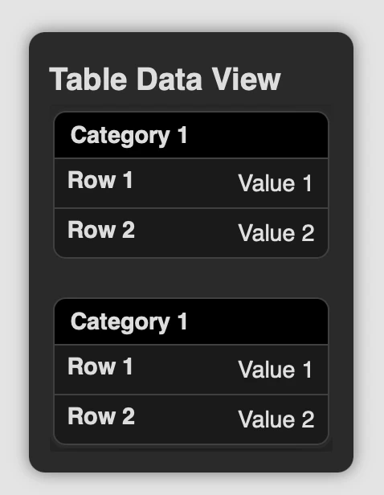

**TableInfoPopUp** (paella-core >= 2.9) plugins add a button that, when clicked, opens a pop-up with a table of information defined by the plugin. This type of plugin is useful for displaying structured data in a clear and accessible way. It is implemented by extending the PopUpButtonPlugin class.


In general, these plugins are not intended to be interactive elements, but rather to display static or dynamic information in an organised manner. To display interactive information, you have the option of using the [Pop Up Button Plugin](/plugins/pop_up_button_plugins) or [Menu Button Plugin](/plugins/menu_button_plugins).

The table information is obtained using the `getContentTableInfo()` method, which must be implemented in the plugin. This method returns an object with the table structure:

```ts
async getContentTableInfo() {
  return {
    table: [
      {
        category: "Category 1",
        rows: [
          {
            key: "Row 1",
            value: "Value 1"
          },
          {
            key: "Row 2",
            value: "Value 2"
          }
        ]
      },
      {
        category: "Category 1",
        rows: [
          {
            key: "Row 1",
            value: "Value 1"
          },
          {
            key: "Row 2",
            value: "Value 2"
          }
        ]
      }
    ]
  }
}
```



See the documentation for the [PopUpButtonPlugin](/plugins/pop_up_button_plugins) and [ButtonPlugin](/plugins/button_plugins) classes for more information on the other configuration parameters and methods you can use to specify the pop-up title, button icon, position, etc.