The general styles of Paella Player and its standard user interface components are defined in the `paella-core` library. They are designed in such a way that they can be customized mainly by modifying the values of a number of CSS variables. This makes it unnecessary to know the internal structure of the DOM tree. 

In addition, the use of CSS variables to configure the appearance of the player makes it possible to make future changes to the DOM tree, while maintaining the compatibility of the modified CSS styles, as long as these changes are made only by modifying the CSS variables.

## Player sizes

Most sizes and margins can be controlled with CSS variables. To understand which variables to modify, the first thing to do is to understand the structure of the player containers. The player is divided into three main areas:

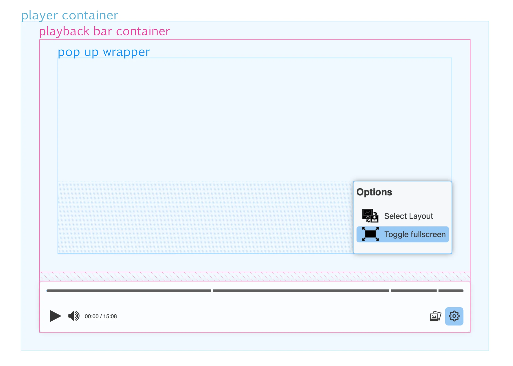

<ul>
    <li><code style="color: #0099aa">player container</code>: is the DOM tree element where the player is placed, and therefore its size and position does not depend on Paella Player. The programmer is responsible for positioning and setting the size within the HTML document.</li>
    <li><code style="color: #ff5588">playback bar container</code>: the container that encompasses the playback bar and the pop-up display area, so it is divided into two parts vertically. The height of the lower part, which corresponds to the playback bar, depends on the final height of the playback bar, and this size in turn depends on the size of the elements that make up the playback bar.</li>
    <li><code style="color: #0055ee">pop up wrapper</code>: the pop-up container is placed inside the upper part of the playback bar container. In this area is where the pop ups are displayed, which can be aligned to the left, to the right or occupy the entire width of the container. In any case, the pop ups will always be displayed aligned to the bottom of the pop up wrapper container.</li>
</ul>

<blockquote>
Note: The video can occupy the whole <span style="color: #0099aa">player container</span>, so that the playback bar is placed over it, or it can be placed on the top of the playback bar, which would correspond to the <span style="color: #ff5588">top area of the playback bar container</span>. This option is not controlled by CSS, but is configured in the player configuration file.
</blockquote>

These are the CSS properties that control the sizes of the containers in the above figure:

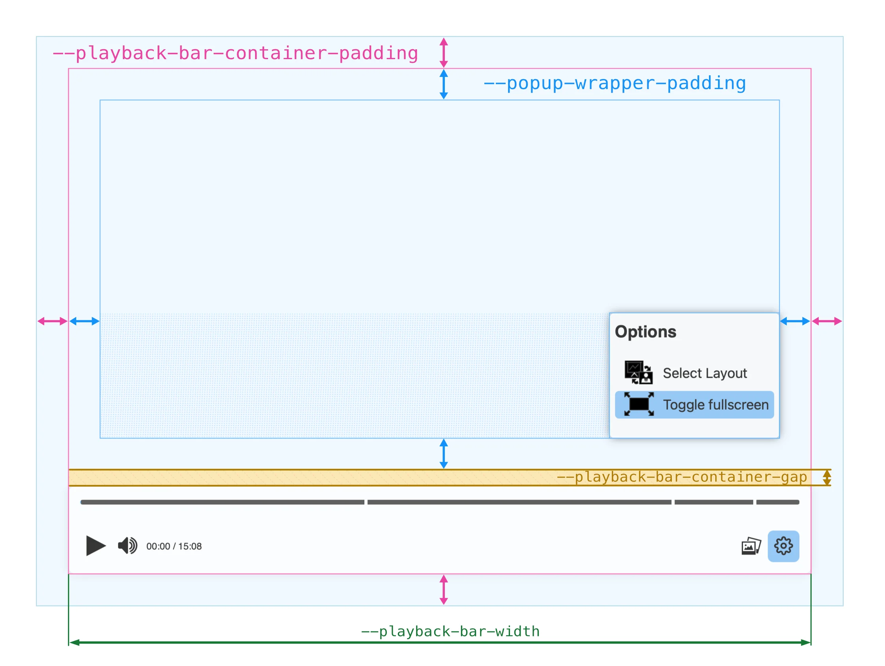

- <code style="color: #ff5588">`--playback-bar-container-padding`</code>: is the padding that separates the playback bar container from the border of the video container. Internally, this variable is used as the value of the `padding` property of the video container, so it can be initialised with a general padding, a vertical and a horizontal padding or with a separate padding for each side.
- <code style="color: #0055ee">`--popup-wrapper-padding`</code>: is the padding that separates the pop up wrapper from the playback bar container. As with the previous variable, the value of this variable is used as the padding of the pop-up container. In this case, the top padding will have no effect, because the pop ups are always aligned to the bottom and sides.
- <code style="color: #ee7700">`--playback-bar-container-gap`</code>: is the gap left between the playbar area and the popup container. Internamentelly, the playback bar container is a flex container, so this variable is used as the value of the `gap` property of the playback bar container.
- <code style="color: #007744">`--playback-bar-width`</code>: is the width of the playback bar. If this size is changed, the playback bar will always be displayed centered.

## Playback bar

The playback bar is the main user interface element of Paella Player. It is the area where the user interacts with the buttons, and where the player displays the progress of the video.

The playback bar is divided into two main areas: the <code style="color: #00aa33">progress indicator</code> area and the <code style="color:rgb(130, 0, 170)">buttons</code> area.

We can control the padding of the buttons and the padding of the progress indicator with the following variables:

- <code style="color: #00aa33">`--progress-indicator-padding`</code>: padding of the progress indicator area.
- <code style="color:rgb(130, 0, 170)">`--playback-bar-buttons-padding`</code>: padding of the buttons area.

Both previous variables are used as the value of the `padding` property of the corresponding area, so we can specify a general padding, a vertical and a horizontal padding or a separate padding for each side.

In addition, the progress indicator is divided into two sections: the elapsed section and the remaining section. We can define the background color of each of these sections with the following variables:

- <code style="color:rgb(17, 143, 227)">`--progress-indicator-completed-bg-color`</code>: background color of the elapsed section.
- <code style="color:rgb(101, 101, 101)">`--progress-indicator-remaining-bg-color`</code>: background color of the remaining section.

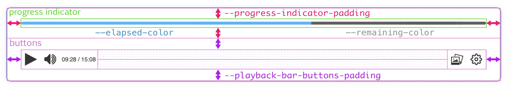

### Slide markers

The progress bar can be displayed in two different ways depending on the characteristics of the video. If the video has slide markers, the progress bar is displayed as follows:

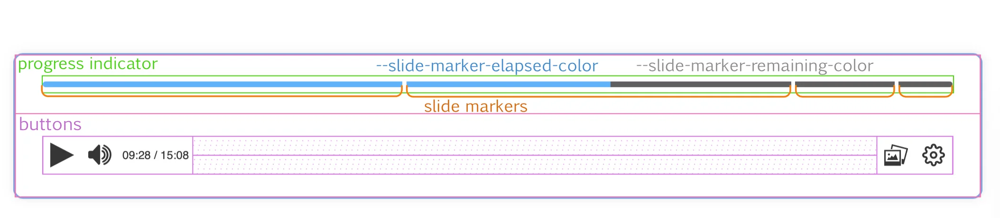

In this case, each independent marker will have elapsed and remaining sections, which will be displayed or not depending on the progress of the video. In this case we can control the background color of these sections with two different variables, in case we want to differentiate the background color of the elapsed and remaining sections from the slide markers and the playback bar without markers:

- <code style="color:rgb(17, 143, 227)">`--slide-marker-elapsed-color`</code>: background color of the elapsed section.
- <code style="color:rgb(101, 101, 101)">`--slide-marker-remaining-color`</code>: background color of the remaining section.

Note that a video will only display the playback bar in one of two ways, as whether or not a video has slide markers is a feature of the video, not the player or its state.

If you want to set the same elapsed and remaining color for both progress bar display modes, simply change the value of `--progress-indicator-complete-bg-color` and `--progress-indicator-remaining-bg-color`, since the `--slide-marker-elapsed-color` and `--slide-marker-remaining-color` variables are initialized by default with the value of the first two.

### Progress indicator sizes

In the progress indicator we can control three sizes:

- <code style="color:rgb(4, 144, 114)">`--progress-indicator-height`</code>: is the height of the progress indicator bar.
- <code style="color:rgb(0, 40, 170)">`--progress-indicator-slide-marker-height`</code>: is the height of the slide marker, which is displayed only when the mouse cursor is over the marker. If the cursor is not over the marker, the size it will be the size specified by `--progress-indicator-height`.
- <code style="color:rgb(197, 132, 0)">`--slide-marker-gap`</code>: is the size of the gap between the slide markers.

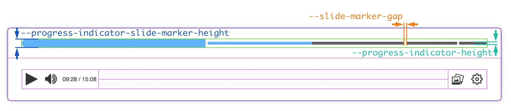


### Other playback bar sizes

We can also control the size of the buttons in the playback bar, its icons, the font size and the border radius of the buttons and the playback bar itself.

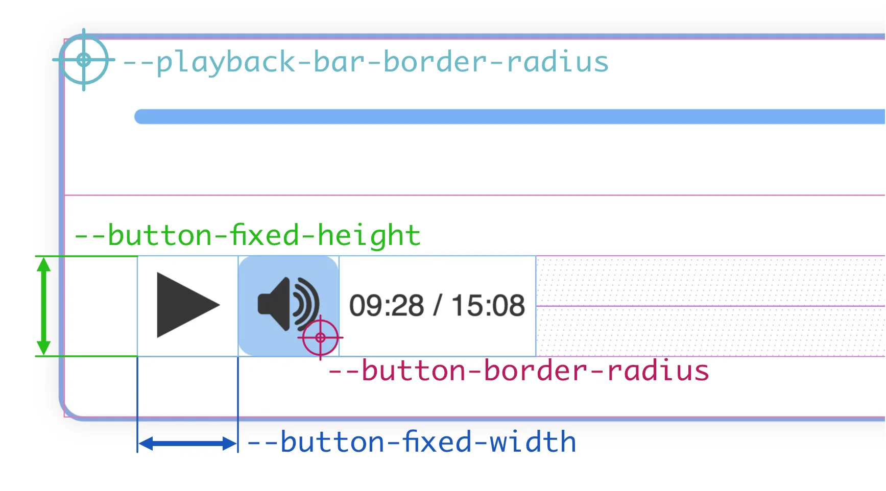

- <code style="color:rgb(1, 156, 164)">`--playback-bar-border-radius`</code>: this variable is used as the value of the `border-radius` property of the playback bar, so you can set the same value for all corners or set a different value for each corner.
- <code style="color:rgb(0, 51, 170)">`--button-fixed-width`</code>: is the width of the buttons in the playback bar. Depending on the configuration of each plugin, a button can have a fixed or variable width. This property only affects fixed-width buttons, hence the prefix `fixed`.
- <code style="color: #008833">`--button-fixed-height`</code>: is the height of the buttons in the playback bar. The `fixed` prefix indicates that this size is related with the `--button-fixed-width` property, but the buttons can not have a non-fixed height.
- <code>`--button-fixed-size`</code>The <code style="color:rgb(0, 51, 170)">`--button-fixed-width`</code> and <code style="color: #008833">`--button-fixed-height`</code> properties are initialized with this value. If you want to set the same size for both properties, you can use this variable.
- <code style="color:rgb(116, 0, 170)">`--button-border-radius`</code>: is the border radius of the buttons in the playback bar. This variable is used as the value of the `border-radius` property of the buttons, so you can set the same value for all corners or set a different value for each corner. Note that, by default, the background color of the buttons is transparent, so the border radius will not be visible until you point the mouse cursor over the button.
- <code>`--button-icon-size`</code>: is the size of the icons in the buttons. By default, this size is half the value of `--button-fixed-width`, but you can set it to any value you want.

### Menus

The drop-down menus in `paella-core` are containers that are displayed above the playback bar. They can be aligned to the left or to the right, or they can occupy the entire width of the playback bar. The position of the container we have seen before, we control it with the `--popup-wrapper-padding` and `--playback-bar-container-gap` properties. The rest of the measures that we can control are shown in the following figure:

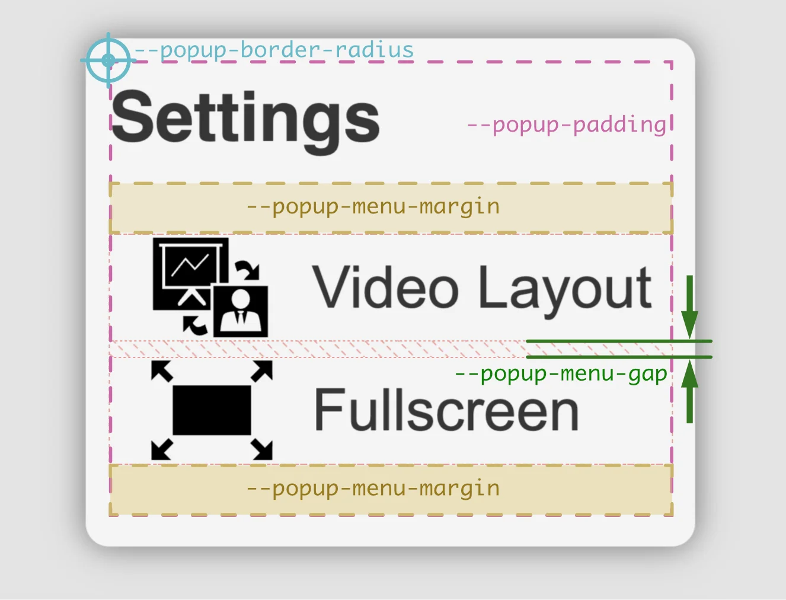

- <code style="color:rgb(0, 170, 162)">`--popup-border-radius`</code>: This is the `border-radius` property of the menu container. You can specify a value for each corner or a general value for all corners.
- <code style="color:rgb(170, 0, 128)">`--popup-padding`</code>: It is the `padding` property of the menu container. You can specify a value for each side or a general value for all sides.
- <code style="color:rgb(170, 111, 0)">`--popup-menu-margin`</code>: This is the `margin` property of the menu item container. We can specify a value for all sides, a vertical and a horizontal value, or a value for each side.
- <code style="color:rgb(10, 130, 4)">`--popup-menu-gap`</code>: The menu items are placed using a flex container. This variable is the value of the `gap` property for that container.

Other sizes that we can control are:

- <code>`--popup-item-height`</code>: This is the height of the menu items. You can specify the `auto` value to make the height fit the menu content, or you can specify a fixed value. If the value is fixed, the menu text will be adjusted to the size of the item.
- <code>`--popup-item-border-radius`</code>: This is the `border-radius` property of the menu items. You can specify a value for each corner or a general value for all corners.

To modify the rest of the sizes of the fonts, see the next section.

The rest of the size properties of the menu items are extracted from the buttons (background colors for states, text and icon colors, icon sizes, etc).

### Font sizes

The playback bar can hold three different font sizes. When a plugin needs to display a text, it can use one of these three sizes. For example, the time indicator next to the volume control is a non-interactive `ButtonPlugin`, with variable width, and it displays the time using the medim font size. The quality selector and the playback rate plugins are interactive `ButtonPlugin`s, with fixed width, and they display the text using the small font size.

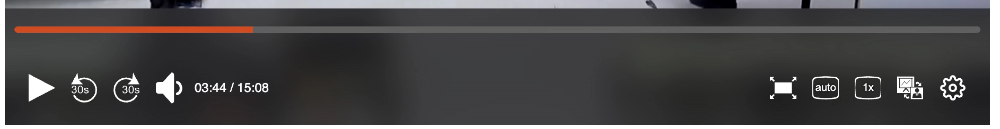

- `--small-text-size`: is the small font size.
- `--medium-text-size`: is the medium font size.
- `--large-text-size`: is the large font size.

<blockquote>
<strong>Note:</strong> The default values of the `--button-fixed-size` and the `--*-text-size` are defined using text font relative sizes, but if you change the size of the buttons, you'll probably need to change the font sizes as well.
</blockquote>

The menus have two texts: on one side is the title of the menu, and on the other side are the texts of the menu items. We can control the size of these texts with the following variables:

- `--popup-title-font-size`
- `--popup-menu-item-font-size`

## Colors

The colors of interface elements can be defined in a granular way (e.g. the background colour of a button) or in a global way. In the default `paella-core` styles there are a number of generic colors, which are then used as defaults in the other variables that control the colors in a granular way. Generally, it will be enough to modify the global colors, but if you need to modify a specific variable you can do that too.

### Global colors

- `--main-fg-color`: main foreground color.
- `--main-bg-color`: main background color. This color must have a certain contrast with the foreground color, so that the text is readable.
- `--main-bg-color-hover`: background color for the `hover` state. As with the previous color, this color must have a certain contrast with the foreground color, so that the text is readable.
- `--secondary-bg-color`: secondary background color. It should be a color similar to `--main-bg-color`, which should also have some contrast with the foreground color.
- `--secondary-bg-color-hover`: secondary background color for the `hover` state.
- `--highlight-bg-color`: highlight background color, for example, one selected option in a menu. This color should contrast with the main color, and should also stand out from the background color.
- `--highlight-bg-color-hover`: highlight background color for the `hover` state.
- `--main-border-color`: main border color used in some elements.
- `--main-outline-color`: main outline color for the input controls. This color is used in the input controls in `focus-visible` state.

<blockquote>
    <strong>Note about SVG code:</strong> In order for `paella-core` to control how SVG icon colors are displayed, internally the fill and stroke colors are specified in the styles. This will only work if the SVG code of the icons does not include the fill and stroke colors explicitly. Also, if the SVG icon is designed to display a fill color but not a stroke color, the root of the image must include the `stroke:none` style attribute. The same applies if the icon is not intended to display a background color, in which case the image root must include the `fill:none` style attribute.
</blockquote>

### Specific colors

- `--button-color`: It is the foreground color of the buttons. It is used in the icon and in the button text. By default this variable is initialized with `--main-fg-color`.
- `--icon-color`: This is the color of the button icon. By default it is `--button-color`.
- `--icon-fill-color`: Button icons using `paella-core` work by adding the `SVG` code to the DOM tree, and therefore it is possible to modify their fill and stroke color. The fill color is set with this variable. The default is `--icon-color`.
- `--icon-stroke-color`: This is the stroke color of the button icons, which is initialized by default to `--icon-color`.
- `--button-background`: This is the background color of the buttons. By default it is transparent, so that it does not interfere with the background color of your container.
- `--button-background-hover`: Is the background color of the buttons in the `hover` state. By default it is `--highlight-bg-color`.
- `--button-background-active`: Is the background color of the buttons in the `active` state. By default it is `--highlight-bg-color-hover`.

### Gradients

There are two color gradients that are used in the playback bar area, and they correspond to the gradient for the normal state and the `hover` state:

- `--playback-bar-gradient`: is the gradient used in the playback bar area.
- `--playback-bar-gradient-hover`: is the gradient used in the playback bar area in the `hover` state.


## Timeline handler

The timeline handler is the element that allows you to control the progress of the video. It is a draggable element that can be moved along the progress bar. The handler has three states: `normal`, `hover` and `active`. The `hover` state is when the mouse cursor is over the handler, and the `active` state is when the mouse button is pressed and the handler is being dragged.

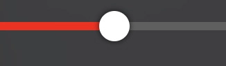

It is possible to control a lot of properties of the handler with CSS variables:

- `--handler-size`: Is the size of the handler.
- `--handler-height`: Is the height of the handler. By default it is initialized with the value of `--handler-size`.
- `--handler-width`: Is the witdth of the handler. By default it is initialized with the value of `--handler-size`.
- `--handler-transition-time`: This is the time interval it will take to modify the handler properties between one state and another (normal, hover or active).

To control the appearance of the handler in the different states (normal, hover and active) we have the following variables, which by adding the suffix `-hover` or `-active` are applied to the corresponding states:

- `--handler-scale`: To control the scale of the handler, the property `transform: scale(S)` is used. This variable controls the value of the `S` parameter. The variables for the hover and normal states are `--handler-scale-hover` and `--handler-scale-active`.
- `--handler-color`: Is the color of the handler. The variables for the hover and normal states are: `--handler-color-active` and `--handler-color-hover`.
- `--handler-shadow`: Is the shadow of the handler. The variables for the hover and normal states are: `--handler-shadow-hover` and `--handler-shadow-active`.
- `--handler-radius`: This is the value of the `box-shadow` property of the handler. The variables for the hover and normal states are: `--handler-radius-hover` and `--handler-radius-active`.
- `--handler-opacity`: This is the opacity of the handler. The variables for the hover and normal states are: `--handler-opacity-hover` and `--handler-opacity-active`.
- `--handler-border`: This is the border of the handler. The variables for the hover and normal states are: `--handler-border-hover` and `--handler-border-active`.


## Effects

### Backdrop filter

The pop up containers and the playback bar include a background effect for the normal and hover states. By default a blur is used, which is more intense in the hover state than in the normal state:

- `--playback-bar-backdrop-filter`: Background filter of the playback bar area.
- `--playback-bar-backdrop-filter-hover`: Background filter of the playback bar area in the `hover` state.
- `--popup-backdrop-filter`: Background filter of the pop up windows.
- `--popup-backdrop-filter-hover`: Background filter of the pop up windows in the `hover` state.

### Shadows

There are several elements that can have a shadow effect. In the default `paella-core` styles, some of these elements do not have the effect applied, but can be added via their corresponding CSS variable:

- `--popup-box-shadow`: It is the value of the `box-shadow` property of pop up windows (e.g. menus).
- `--playback-bar-shadow`: It is the value of the `box-shadow` property of the playback bar area.
- `--handler-shadow`: It is the value of the `box-shadow` property for the progress indicator controller.
- `--handler-shadow-hover`: It is the value of the `box-shadow` property for the progress indicator controller in the `hover` state.
- `--handler-shadow-active`: It is the value of the `box-shadow` property for the progress indicator controller in the `active` state.
- `--timeline-preview-box-shadow`: It is the value of the `box-shadow` property for the timeline preview area. This area is the container that displays the preview image and the time instant when we hover the mouse cursor over the timeline.

## All CSS variables

### General variables

- `--main-fg-color`
- `--main-bg-color`
- `--main-bg-color-hover`
- `--secondary-bg-color`
- `--secondary-bg-color-hover`
- `--highlight-bg-color`
- `--highlight-bg-color-hover`
- `--main-border-color`
- `--main-outline-color`
- `--button-color`
- `--icon-color`
- `--icon-fill-color`
- `--icon-stroke-color`
- `--player-font-family`

### Buttons

- `--button-fixed-size`
- `--button-fixed-width`
- `--button-fixed-height`
- `--button-border-radius`
- `--button-icon-size`
- `--button-background`
- `--button-background-hover`
- `--button-background-active`

### Fonts

- `--progress-indicator-font-size`
- `--small-text-size`
- `--medium-text-size`
- `--large-text-size`

### Playback bar

- `--playback-bar-buttons-padding`
- `--playback-bar-gradient`
- `--playback-bar-gradient-hover`
- `--playback-bar-backdrop-filter`
- `--playback-bar-backdrop-filter-hover`
- `--playback-bar-width`
- `--playback-bar-container-padding`
- `--playback-bar-container-gap`
- `--playback-bar-border-radius`
- `--playback-bar-border-color`
- `--playback-bar-border-style`
- `--playback-bar-border-width`
- `--playback-bar-shadow`
- `--progress-indicator-padding`
- `--progress-indicator-elapsed-color`
- `--progress-indicator-remaining-color`
- `--progress-indicator-height`
- `--progress-indicator-slide-marker-height`
- `--progress-bar-radius`

### Timeline handler 

- `--handler-size`
- `--handler-height`
- `--handler-width`
- `--handler-scale`
- `--handler-color`
- `--handler-shadow`
- `--handler-radius`
- `--handler-opacity`
- `--handler-border`
- `--handler-transition-time`
- `--handler-scale-hover`
- `--handler-color-hover`
- `--handler-shadow-hover`
- `--handler-radius-hover`
- `--handler-opacity-hover`
- `--handler-border-hover`
- `--handler-scale-active`
- `--handler-shadow-active`
- `--handler-color-active`
- `--handler-radius-active`
- `--handler-opacity-active`
- `--handler-border-active`

### Timelilne colors

- `--elapsed-color`
- `--remaining-color`
- `--slide-marker-elapsed-color`
- `--slide-marker-remaining-color`
- `--slide-marker-gap:`

### Timeline sizes

- `--timeline-preview-gap`
- `--timeline-preview-border-radius`
- `--timeline-preview-box-shadow`
- `--timeline-preview-padding`
- `--timeline-preview-background`
- `--timeline-preview-color`
- `--timeline-preview-max-image-block-size`

### Video container

- `--video-container-padding`
- `--video-container-gap`
- `--video-container-background-color`
- `--base-video-rect-background-color`
- `--video-container-message-bkg`
- `--video-container-message-color`

### Pop up/Menus

- `--popup-wrapper-padding`
- `--popup-backdrop-filter`
- `--popup-backdrop-filter-hover`
- `--popup-border-radius`
- `--popup-box-shadow`
- `--popup-padding`
- `--popup-menu-margin`
- `--popup-menu-gap`
- `--popup-menu-item-height`
- `--popup-menu-item-font-size`
- `--popup-menu-item-border-radius`
- `--popup-title-font-size`

## Examples

### Floating playback bar with rounded borders:

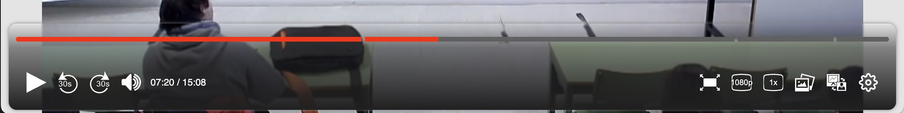

```css
:root {
    --playback-bar-width: calc(100% - 2 * var(--playback-bar-container-padding));
    --playback-bar-radius: 10px;
    --playback-bar-container-padding: 5px;
    --playback-bar-border-color: var(--main-border-color);
    --playback-bar-border-style: solid;
    --playback-bar-border-width: 0;
    --playback-bar-shadow: 0 0 5px 0 var(--main-border-color);
}
```

### Black over white playback bar

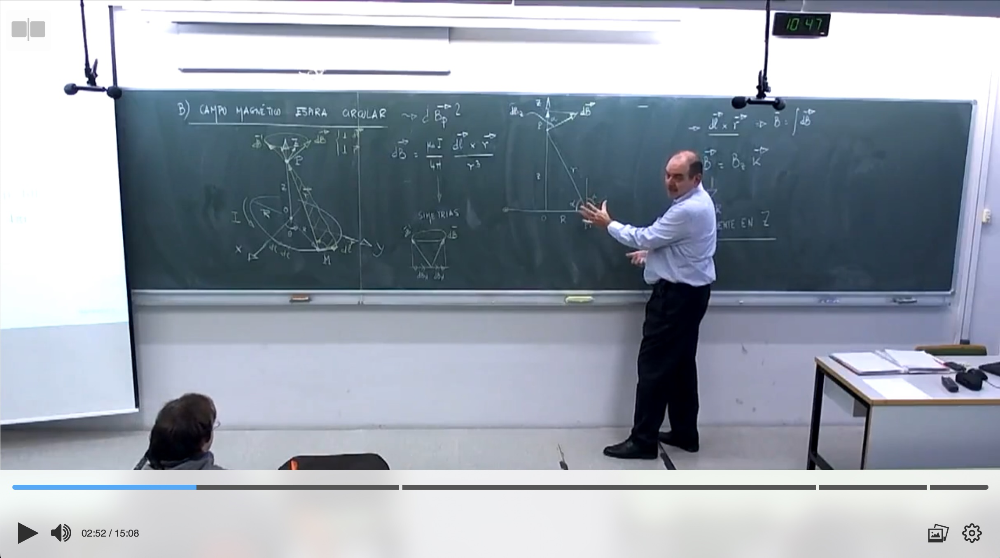

```css
:root {
    --highlight-bg-color: #61b2f9;
    --highlight-bg-color-hover: #97c9f5;
    --main-fg-color: rgb(54, 54, 54);
    --main-bg-color: rgba(170, 170, 170, 0.923);
    --main-bg-color: rgba(248, 248, 248, 0.78);
    --secondary-bg-color: rgb(241, 241, 241);
    --secodnary-bg-color-highlight: white;

    --playback-bar-gradient: linear-gradient(0deg, rgb(255 255 255 / 70%) 0%, rgb(255 255 255 / 50%) 60%, rgb(255 255 255 / 0%) 100%);
    --playback-bar-gradient-hover: linear-gradient(0deg, rgb(255 255 255 / 80%) 0%, rgb(255 255 255 / 80%) 0%);
    --playback-bar-buttons-padding: 15px 15px;
}
```

### Control the visibility of the timeline handler, depending on its state:

```css
:root {
    /* Only visible in hover and active states */
    --handler-opacity: 0;
    --handler-opacity-hover: 1;
    --handler-opacity-active: 1;
}
```

### Modify the properties of one specific button

It is also possible to specify specific colors for certain `ButtonPlugin` plugins (or their derivatives). Plugins of type `ButtonPlugin` initialise the `name` attribute of the button with the plugin identifier:

```html
<button type="button" name="es.upv.paella.playPauseButton" class="fixed-width" aria-label="play" title="play">
    ...
</button>
```

Therefore, you can specify the properties for a specific button using the following selectors:

```css
.playback-bar ul>li>button[name="es.upv.paella.playPauseButton"] {
    color: var(--highlight-bg-color);
    background-color: var(--main-fg-color);

    & svg {
        fill: white;
        stroke: white;
    }
}

.playback-bar ul>li>button[name="es.upv.paella.playPauseButton"]:hover {
    background-color: var(--highlight-bg-color);
}

.playback-bar ul>li>button[name="es.upv.paella.playPauseButton"]:active {
    background-color: var(--highlight-bg-color-hover);
}
```

Note that when specifying properties for a specific button, you cannot simply modify the values of CSS variables. In this case you will have to directly change the properties you want to modify. The properties that affect the colour of the buttons are the ones you saw in the example above: `color` and `background-color` on the button, and `fill` and `stroke` on the SVG it contains.

