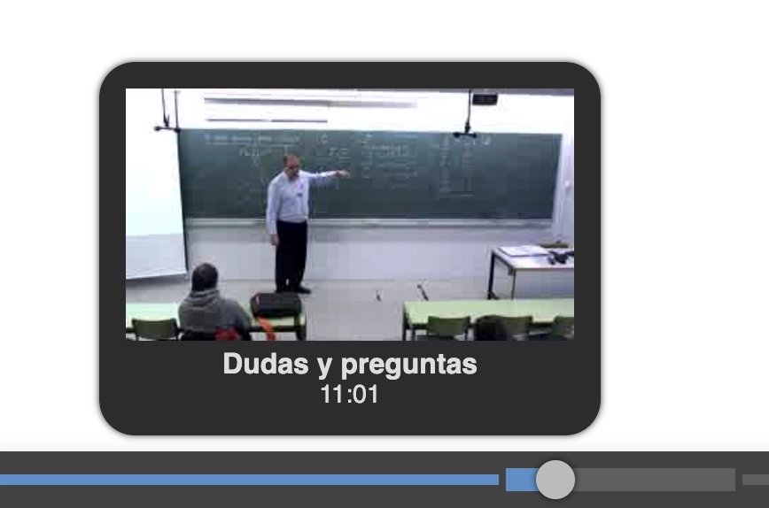
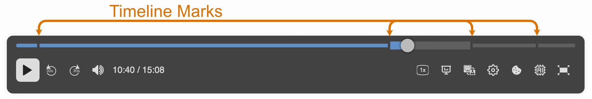

The timeline is a visual tool used to represent the progression of video content over time. It provides users with an overview of the video structure, allowing them to navigate key moments, chapters, or slides efficiently. The timeline can be enhanced with marks and thumbnails to improve the user experience and make navigation more intuitive.

## Timeline Preview

The timeline preview is a visual representation of the video content, showing key moments or segments. It is presented when the user hovers over the timeline. This preview helps users quickly identify important parts of the video without having to watch the entire content.



The timeline preview contains between one and three pieces of information:

- **Timeline snapshot**: this is the only data that is always available, and shows the time instant that corresponds to the point in the timeline where the user is hovering the mouse cursor.
- Timeline image**: is an image representative of the time instant that corresponds to the point in the timeline where the user is hovering the mouse cursor. This image can come from several sources, which we will see below.
- Chapter title**: this is a text that shows the title of the chapter corresponding to the point in the timeline where the user is hovering the mouse cursor. This is only available if the video manifest contains chapter information.

There are three data sources to provide the images for the timeline:

- Timeline image: A grid of thumbnails representing the video's temporal instants.
- Chapter images: Specific thumbnails for each chapter of the video.
- Slide images: Thumbnails representing slides in the video.

### Timeline Image

It uses an image of MxN thumbnails, all of the same size, representing the video's temporal instants. The number of thumbnails per row and column is variable and is configured in the video manifest, in the `timeline` attribute of the `metadata` section. This attribute is an object containing the attributes `url`, `rows`, and `cols`, which indicate the URL of the timeline image, the number of rows, and the number of columns, respectively. If we have 10 rows and 10 columns, we will have 100 thumbnails, so each thumbnail will represent 1/100 of the total video time.

For example, the `timeline` attribute in the video manifest can have the following format:

```json
{
    "metadata": {
        "timeline": {
            "url": "timeline.jpg",
            "rows": 10,
            "cols": 10
        },
        ... other metadata attributes ...
    }
    ...
}
```

This indicates that the timeline image contains 10 rows and 10 columns, forming a grid of thumbnails representing the video's temporal instants. The specified URL points to the image containing these thumbnails.

If you want to manually generate the timeline image, you can use the following line of [ffmpeg](https://ffmpeg.org/):

```bash
ffmpeg -i video.mp4 -vf "fps=1,scale=320:180,tile=10x10" -frames:v 1 timeline.jpg
```

The resulting image will look something like the following:


### Chapters

The chapters attribute is used to provide a representation of the video content divided into chapters. Each chapter contains a title, description, start time and an optional thumbnail image. If the chapters are configured, and contains thumbnails, they can be used to display chapter-specific images on the timeline in the case where the timeline image is not specified in the metadata section.

To configure chapters, the `chapters` attribute in the video manifest must include a `chapterList` array. Each chapter object contains the following properties:

- **id:** Unique identifier of the chapter.
- **title:** Title of the chapter displayed in the user interface.
- **description:** Optional description providing additional context about the chapter.
- **time:** Start time of the chapter, in seconds.
- **thumb:** Optional URL of the chapter thumbnail image.

Example configuration:

**Video manifest**

```json
{
  ... other attributes ...
  "chapters": {
    "chapterList": [
      {
        "id": "chapter_1",
        "title": "Introduction",
        "description": "Overview of the video content",
        "time": 0,
        "thumb": "chapter_1_thumb.jpg"
      },
      {
        "id": "chapter_2",
        "title": "Main Content",
        "description": "Detailed explanation",
        "time": 60,
        "thumb": "chapter_2_thumb.jpg"
      }
    ]
  }
}
```

Please note that more data can be included in the chapter information than is shown in the timeline. This is because this data can be used by other Paella Player plugins. The only relevant data for the timeline are the title, the time instant and the thumbnail.

### Frame list

The frame list is a collection of images extracted form the presentation video, generally key frames that can be used to provide a visual representation of the slide content. In the case where neither the `timeline` nor the `chapters` attributes are specified, the frame list can be used to display thumbnails on the timeline.

To configure the frame list, we can use the `frameList` attribute in the video manifest. This attribute must include two properties: `targetContent` and  `frames`.

The `targetContent` attribute indicates the type of content the frames represent. The value is related with the `content` attribute of the video source from which the frames are extracted. For example, if your video manifest contains two streams, and the stream used to generate the frames is marked with `content: "presentation"`, then the `targetContent` should also be set to `"presentation"`. To get more information about the `content` attribute, refer to the [video manifest documentation](/reference/video_manifest).

The `frames` attribute is an array that contains the individual frame objects. Each frame object contains the following properties:

- **id:** Unique identifier of the frame.
- **mimetype:** Mimetype of the image.
- **time:** Time instant corresponding to the frame, in seconds.
- **url:** URL of the full-sized image.
- **thumb:** URL of the thumbnail image.

Example configuration:

**Video manifest**

```json
{
  ... other attributes ...
  "frameList": {
    "targetContent": "presentation",
    "frames": [
      {
        "id": "frame_1",
        "mimetype": "image/jpeg",
        "time": 0,
        "url": "frame_1.jpg",
        "thumb": "frame_1_thumb.jpg"
      },
      {
        "id": "frame_2",
        "mimetype": "image/jpeg",
        "time": 60,
        "url": "frame_2.jpg",
        "thumb": "frame_2_thumb.jpg"
      }
    ]
  }
}
```

## Timeline Marks

The timeline marks are a representation of specific moments in the video that can be highlighted on the timeline. They provide a way to visually indicate important segments or key frames within the video content.



The `timelineMarks` attribute in the manifest's `metadata` object is used to determine the data source for these marks. It is possible to set it to `frameList`, which means that the timeline thumbnails are extracted from the `frameList` attribute of the manifest, or to `chapters`, which means that the marks will be derived from the chapters defined in the `chapters` attribute of the manifest.

```json
"metadata": {
  "timelineMarks": "frameList",
  ...
}
```

If the `timelineMarks` attribute is not provided, and the video manifest contains both `frameList` and `chapters`, the player will use the `chapters` as the default source for timeline marks. If only one of these attributes is present, that will be used as the source for timeline marks.

For more information about timeline integration, refer to the [video manifest documentation](/reference/video_manifest).
